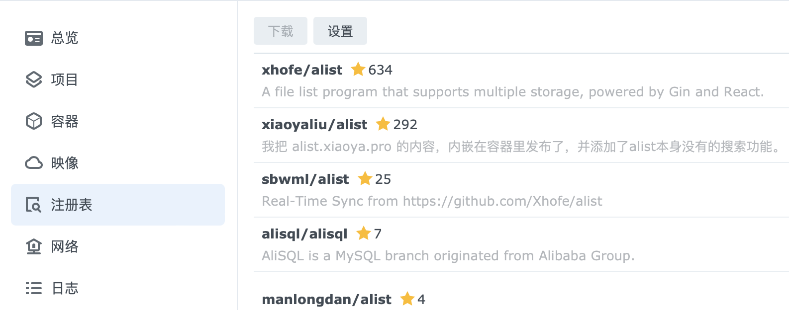
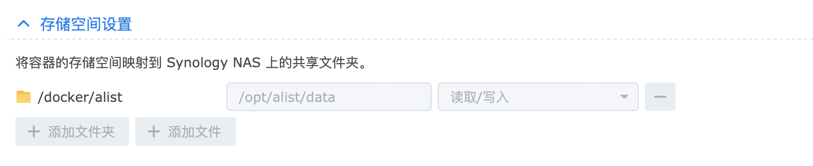
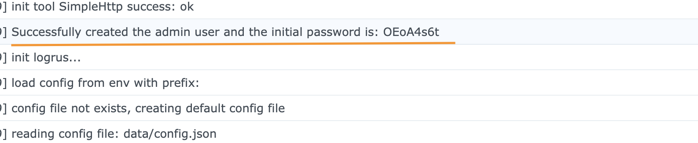
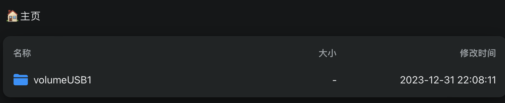

### 群晖 Alist 安装、配置、webDav 同步

- Docker 安装
    * 搜索 alist，下载并配置；
    
    * 配置 alist，配置项大部分默认，网络这边选择 HOST，存储空间这边添加一个映射；
    
    * 启动 alist，等待启动完成后，请查看容器运行的 log，以便得到管理员密码；
    

- 添加存储
    * 使用之前 log 记录的管理员密码登录管理地址 http://xxx.xxx.xxx.xxx:5244；
    * 建议开启`设置-全局-签名所有`，以确保安全性；
    * 添加存储，选择你需要的网盘类型，示例使用`阿里云盘open`，建议配置选项`WebDAV 策略`设置为`本地代理`以取得更好的兼容性。
    * 添加必要项后存储，返回首页应该就可以看到添加的云盘；
    
- 使用
    * 可直接进行网页下载，如果安装了`Aria2`也可以直接在`设置-其它-Aria2`设置相应内容，以便直接在页面调用`Aria2`进行下载；
    * 可以在群晖中安装`Cloud Sync`，并添加之前添加的阿里云盘存储。服务器地址：`http://xxx.xxx.xxx.xxx:5244/dav`，远程路径可单独设置一个文件夹进行同步，有需要的文件就放进去，就会同步到 NAS；